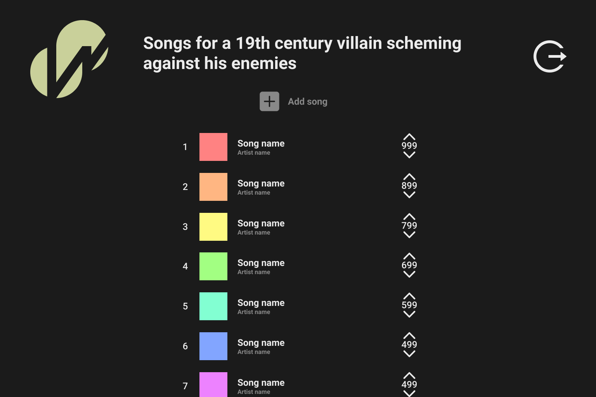

<div id="top"></div>
<!--
*** Thanks for checking out the Best-README-Template. If you have a suggestion
*** that would make this better, please fork the repo and create a pull request
*** or simply open an issue with the tag "enhancement".
*** Don't forget to give the project a star!
*** Thanks again! Now go create something AMAZING! :D
-->


<!-- PROJECT LOGO -->
<br />
<div align="center">
  <a href="https://github.com/othneildrew/Best-README-Template">
    
  </a>

  <h3 align="center">Oliver Gannon</h3>

  <p align="center">
    Playlist collaboration: how can mass co-operation help us find more music?
  </p>
</div>


<!-- ABOUT THE PROJECT -->
## About The Project



Making and discovering music together has always been part of our history as humans, and especially today as music is shared between online communities. However, existing systems are rudimentary at best; they’re not only unrepresentative but also make it struggle to offer new music that is more suited for the listener. This report shows how developing a web application that tackles this problem in a different way can help remedy the key issues faced. The principles of this application are that users will be able to upvote or downvote music on specific collections and have the option to personalise these collections to be presented with music that they will like the most.  Cosine similarity was used to draw similarities between user’s libraries and the songs in the collections. User evaluation showed that while the voting system wasn’t as effective in our use-case, most agreed that with a larger subset of users the application would work much better, and even in this use case they felt they could collaborate effectively, and far more than most existing solutions. In general the recommendations were found to have average approval, and overall this project has shown that collaborative voting systems for music discovery is more effective with more users. 


### Built With

* [Django](https://www.django-rest-framework.org/)
* [Spotify API](https://developer.spotify.com/)
* [Flutter](https://flutter.dev/)
* [SciKitLearn](https://scikit-learn.org/stable/index.html)
* [VS Code](https://code.visualstudio.com/)


<!-- GETTING STARTED -->
## Getting Started

The process of getting this running is long and tedious. Unfortunately due to the heavy reliance on interconnectivity between the Spotify API, Django and Flutter, consistent URLs will need to be updated in every single document. This means you will actually have to register for your own Spotify application for this to work.

### Prerequisites

* You will need a spotify account.
* You will need 
* You will need 

### Installation

_Below are instructions on how to install this on your own machine._

1. Navigate to `django\wasabisWorkshop`, and type:
    ```sh
    pip install -r requirements.txt
    ```
2. Navigate to `flutter\` and type:
   ```sh
   flutter pub get
   ```
3. Go to  and create your app

4. Copy Client ID and Client Secret and paste them into `django\wasabisWorkshop\workshop\credentials.py`

5. In `django\wasabisWorkshop` type:
    ```sh
    python manage.py runserver
    ```
6. Copy whatever the base URL (likely `127.0.0.1:8000`) is and paste it into `root_url` in `flutter\lib\global_variables.dart`

7. Choose a port (can be any available on your computer), and run:
      ```sh
      flutter run lib/main.dart --web-port=CHOOSE_YOUR_WEB_PORT_HERE
      ```
8. Copy whichever URL you are directed to first, with `/spotify-auth` on the end, like so:
    ```sh
      http://localhost:65332/spotify-auth
      ```
9. Back on your dashboard for Spotify, Edit settings > and add the redirect URI for Spotify

10. I haven't ever ran this without full visual studio code support so this may not work. If you're encountering issues, I recommend you install the plugins on VS code and try running it through that.

<!-- CONTRIBUTING -->
## Contributing

Contributions are what make the open source community such an amazing place to learn, inspire, and create. Any contributions you make are **greatly appreciated**.

If you have a suggestion that would make this better, please fork the repo and create a pull request. You can also simply open an issue with the tag "enhancement".
Don't forget to give the project a star! Thanks again!

1. Fork the Project
2. Create your Feature Branch (`git checkout -b feature/AmazingFeature`)
3. Commit your Changes (`git commit -m 'Add some AmazingFeature'`)
4. Push to the Branch (`git push origin feature/AmazingFeature`)
5. Open a Pull Request

<p align="right">(<a href="#top">back to top</a>)</p>
